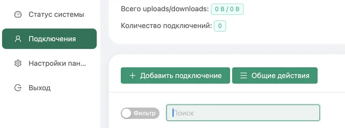
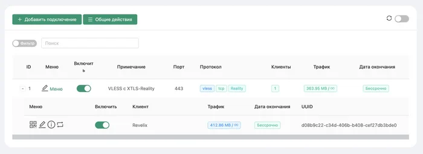
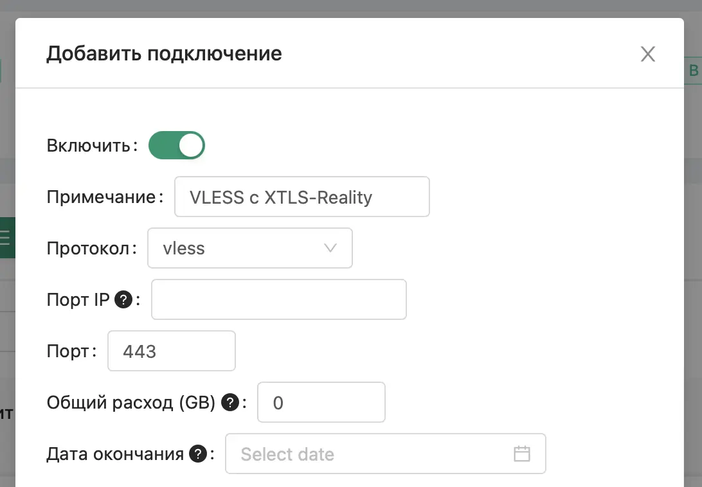
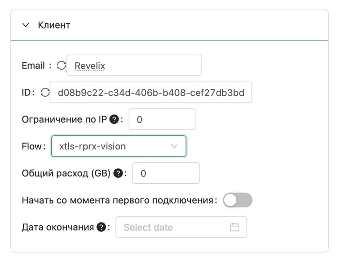
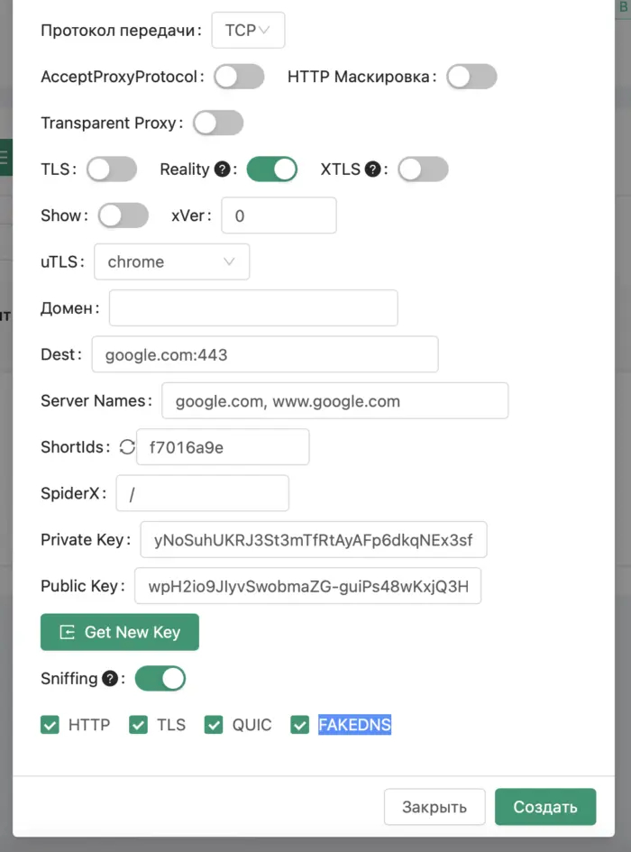

# Create protocls 

## Steps to follow

1. Open the web panel: `http:xxx.xxx.xxx.xxx:PORT/panel/`
2. Login using the creds.  
3. In 3X-UI panel, add a connection: Connections > Add. 

4. Enter the connection properties: . See: [Connection properties](#connection-properties). 
5. Confirm after setting up transport (**Save**). 
 

After this, you can: 

* Manage users 
* Drop traffic (сбросить трафик)
* Export the keys and more  

> Перед подключением устройств, которые будут использовать VPN соединение с сервером. Можно зайти в настройки панели и поменять пароль, если он у вас не слишком сложный. А лучше всего включить ещё и секретный токен для максимальной безопасности (обязательно сохранить в надёжном месте!)
>  
> Также сейчас или после окончательной настройки можно покопаться в настройках, особенно в разделе Конфигурация Xray.

## Connection properties  

Basics:  

* Примечание — любое название
* Протокол — vless
* Порт IP — оставляем пустым
* Порт — вместо рандомного ставим 443 

Client settings: 

* Email - Напишите название клиента. У меня это Revelix.
* Flow — выбрать xtls-rprx-vision. Поле Flow (см. скриншот) появится только после того, как чуть ниже вы поставите галочку на пункте Reality  

 

Protocol settings: 

* Протокол передачи: TCP
* AcceptProxyProtocol, HTTP Маскировка, Transparent Proxy, TLS — всё это должно быть выключено
* xVer — оставьте значение 0
* Reality — должно быть включено
* XTLS — наоборот, должно быть выключено. Возможно тут вам стало не понятно, так как Reality тоже относится к XTLS. Но, здесь под XTLS подразумеваются только устаревшие версии протокола. А переключатели XTLS и Reality в панели являются взаимоисключающими.
* uTLS — тут надо выбрать то, под какой браузер будет маскироваться наше VPN соединение. Но, можете выбрать chrome - так будет лучше всего.
* Домен — на самом деле это адрес для подключения к вашему серверу. Оставьте пустым, и тогда туда автоматически подставится IP-адрес сервера.
* Dest — это destination, то есть «назначение» — тут указываем домен и порт для переадресации google.com:443
* Server names — это домен, под который вы будете маскироваться. Меням на google.com, www.google.com
* ShortIds — это приватный ключ, сгенерируется автоматически.
* Public Key, Private Key — нажмите на кнопку Get new keys, и ключи сгенерируются автоматически.
* Sniffing, HTTP, TLS, QUIC, fakedns — оставьте включённым.

